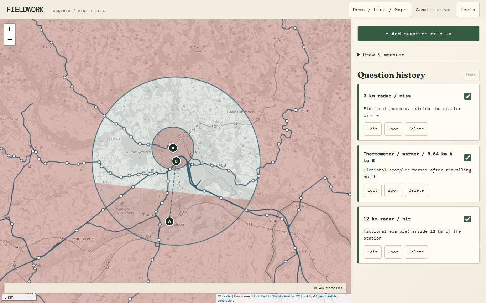
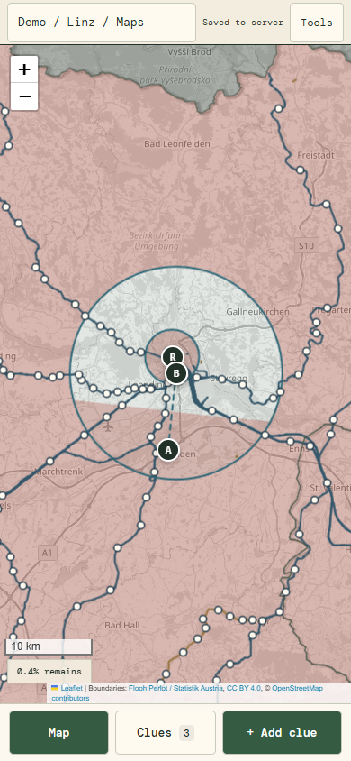
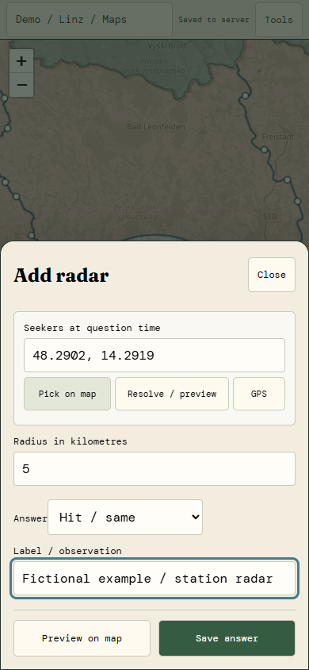

# Fieldwork

A shared map for real-world Hide & Seek. Add answers as you play and see which
areas remain possible.

Built quickly with AI assistance for a personal, three-player Hide & Seek trip
in Austria. It worked well during our game, but hasn't been extensively tested
beyond that setup. Expect rough edges.



## What it does

- Radar, warmer/colder, same-region and nearest-place comparisons.
- Distance bands around borders, railway corridors or your own lines.
- Manual shapes, notes and a separate map for each round.
- Automatic server saves, conflict recovery and JSON import/export.
- Mobile layout with street, railway and satellite views.

 

Screenshots use fictional demo data, not a real game's locations.

## Run locally

Requires Python 3.11 or newer. No build step or Python packages needed.

```sh
python start.py
```

Open **http://127.0.0.1:4173**. This mode has no login and binds only to your
computer; do not expose it through a tunnel. Data stays in `data-local/`.

Use **Add clue**, enter the answer, preview it and save. Coordinates, map taps,
station names and Google Maps dropped-pin links are supported. The map-name
button creates and switches rounds. **Tools** contains layers and import/export.
Import `examples/demo.json` to try the screenshot scenario; imports add rounds.

For friends on other devices, see [self-hosting](docs/HOSTING.md). This needs a
backend; GitHub Pages alone cannot run the shared board.

## Scope

The supplied game area is **Austria excluding Tirol and Vorarlberg**. Boundary
data is from 2021; railway snapshots are from September 2026. These are not live
timetables. High-speed rail is an explicit game-corridor definition, not a
speed classification. See [datasets and attribution](docs/DATA.md).

Everyone with access can read and edit every round. Keep hider secrets elsewhere.
Incomplete candidate lists stay provisional until you confirm them. Distances
and boundaries are approximate; use your agreed rules for close calls. Map tiles
need internet access; retained drafts are not an offline-map feature.

An independent fan-made tool, not affiliated with or endorsed by Jet Lag: The Game.
No official cards or rulebook are included.

## Development

The author credits OpenAI's GPT-6-Astra for the AI-assisted implementation,
guided by the group's requirements and refined through two days of real-world
playtesting. This was a practical one-off project, shared because others may
find it useful.

Plain JavaScript, Leaflet, Geoman and Turf; a Python standard-library API with SQLite.

```sh
python -m unittest server_test auth_test
node --test geometry.test.cjs features.test.cjs corridors.test.cjs
```

See [contributing](CONTRIBUTING.md) and [security](SECURITY.md). Application code
is MIT licensed; bundled libraries and geographic data retain their
[own licences](THIRD_PARTY.md).
